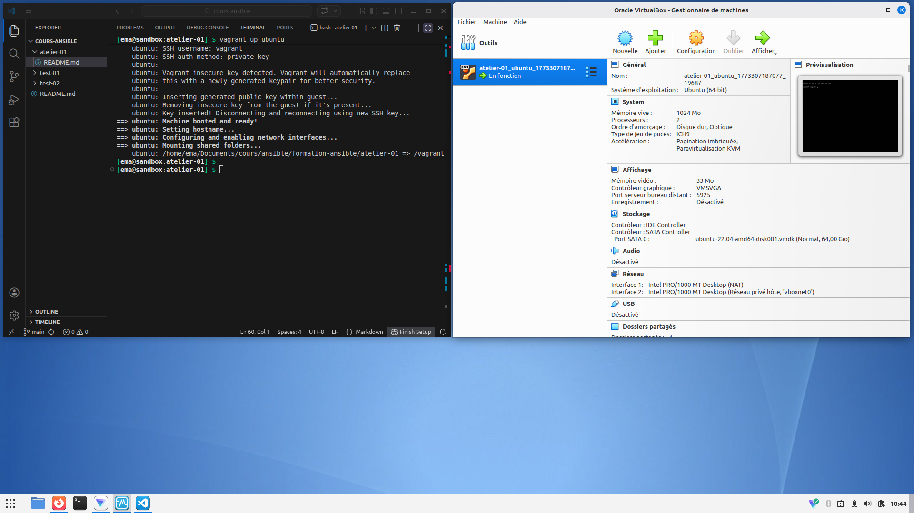
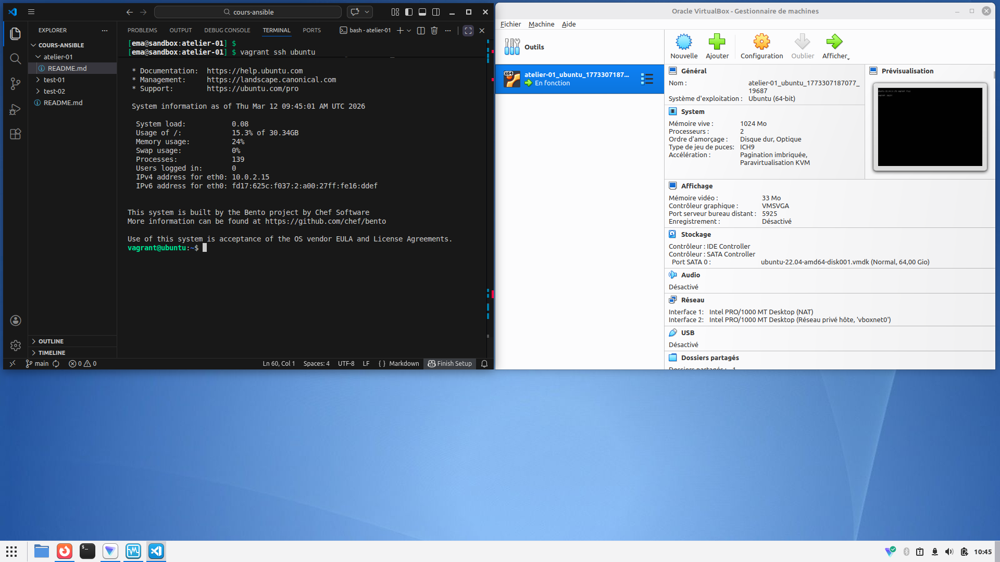
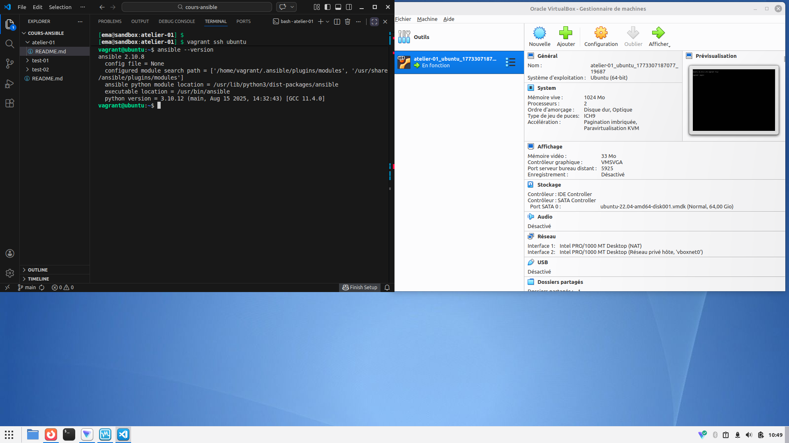
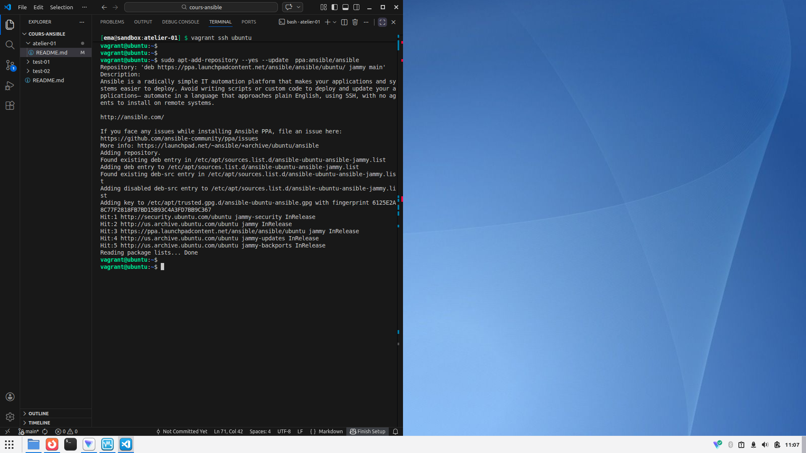
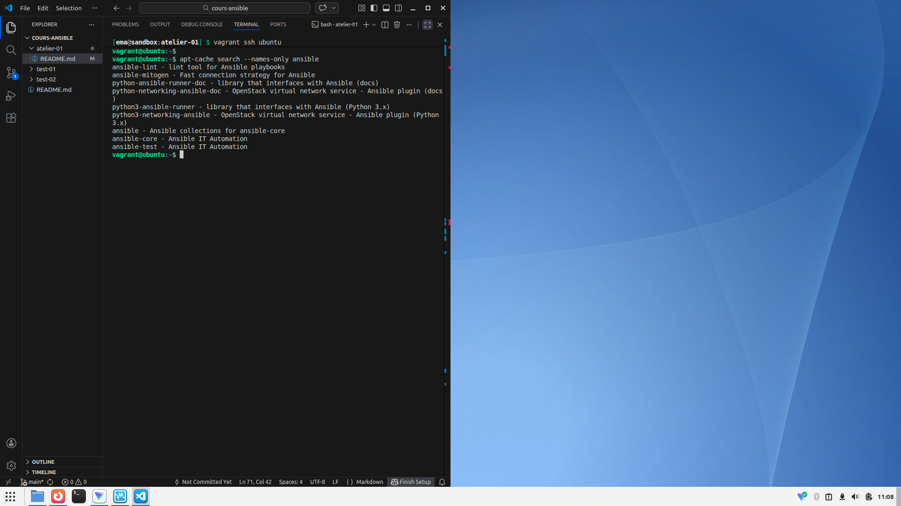
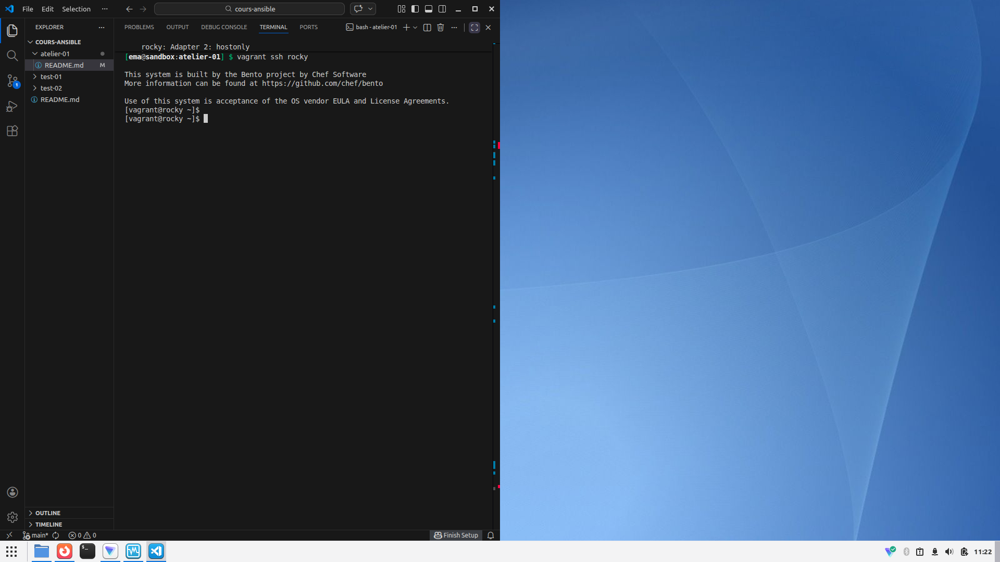
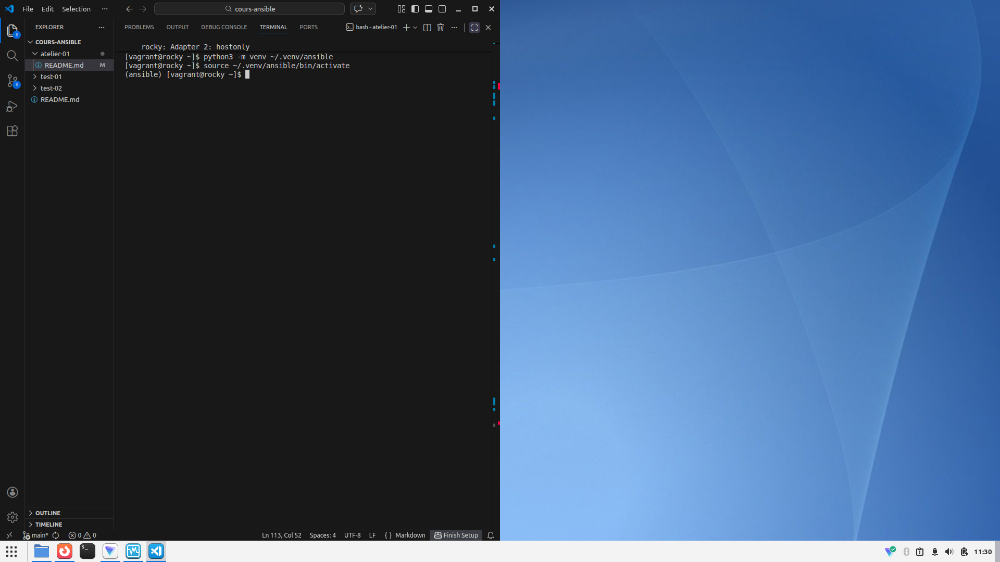
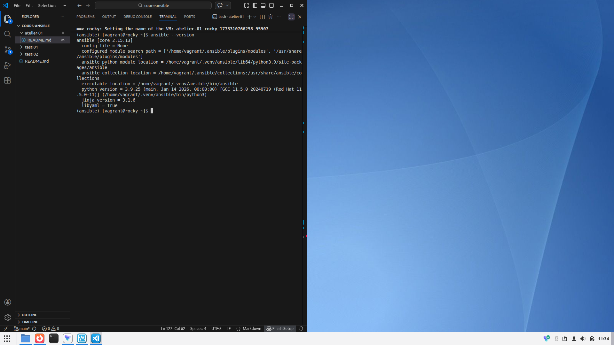

# Atelier 1 - Installation de Ansible

## Objectif

#### Challenge n° 1

- Démarrez la VM ubuntu depuis le répertoire atelier-01.

- Connectez-vous à cette VM.

- Rafraîchissez les informations sur les paquets.

- Recherchez le paquet ansible avec les options qui vont bien.

- Installez le paquet officiel fourni par la distribution.

- Vérifiez si l'installation s'est bien déroulée.

- Notez la version d'Ansible.

- Déconnectez-vous et supprimez la VM.

#### Challenge n° 2

- Répétez le challenge précédent en configurant un dépôt PPA (Personal Package Archive) pour Ansible :

```console
$ sudo apt-add-repository ppa:ansible/ansible
```

- Notez la version fournie par ce dépôt tiers et comparez avec la version officielle du challenge précédent.

#### Challenge n° 3

- Lancez une VM Rocky Linux et installez Ansible en utilisant PIP et Virtualenv.

---


## Challenge n°1

Démarrez la VM ubuntu depuis le répertoire atelier-01.

```console
[user@sandbox:atelier-1] vagrant up ubuntu
```


Connectez-vous à cette VM.

```console
[user@sandbox:atelier-1] vagrant ssh ubuntu
```



Rafraîchissez les informations sur les paquets.

```console
vagrant@ubuntu~$ sudo apt update
```

Recherchez le paquet ansible avec les options qui vont bien.

```console
vagrant@ubuntu~$ apt-cache search --names-only ansible

    ansible - Configuration management, deployment, and task execution system
    ansible-core - Configuration management, deployment, and task execution system
    ansible-lint - lint tool for Ansible playbooks
    ansible-mitogen - Fast connection strategy for Ansible
    ...
```


Installez le paquet officiel fourni par la distribution.

```console
vagrant@ubuntu~$ sudo apt install ansible -y
```

Vérifiez si l'installation s'est bien déroulée et notez la version d'Ansible

```console
vagrant@ubuntu~$ ansible --version

    ansible 2.10.8
    ...
```


Déconnectez-vous et supprimez la VM.

```console
vagrant@ubuntu~$ exit
[user@sandbox:atelier-1] -f ubuntu
```

---

## Challenge n°2

Tout d'abord, reprenez le début de la procédure du challenge n°1 pour recréez une VM et mettre à jour ses repository.

A présent nous pouvons ajoutr les PPA Ansible (Personal Package Archive) qui, comme son nom l'indique, sont des packages spécifique à Ansible :

```console
vagrant@ubuntu~$ sudo apt-add-repository --yes --update ppa:ansible/ansible
```


Vous devrez trouver comme ci-dessous les packages suviants :
```console
vagrant@ubuntu~$ apt-cache search --names-only ansible
    ...
    ansible - Ansible collections for ansible-core
    ansible-core - Ansible IT Automation
    ansible-test - Ansible IT Automation
```


Ces packages vont nous permettre d'installer ansible avec APT :

```console
vagrant@ubuntu~$ sudo apt install ansible
```

Vous pouvez verifier que son installation a été réalisée avec succès en testant une commande simple tel que celle affichant sa version. Ici nous avons la version 2.17.14
```console
vagrant@ubuntu~$ ansible --version

    ansible [core 2.17.14]
    ...
```

Note : On peut remarquer que la version de ansible ici est moins récente que celle du package du repository standard utilisé dans le challenge précédent.

Déconnectez-vous et supprimez la VM.

```console
vagrant@ubuntu~$ exit
[user@sandbox:atelier-1] -f ubuntu
```

---

## Challenge n°3

Commencez par lancez une VM rocky et connectez-vous :

```console
[user@sandbox:atelier-1] vagrant up rocky
[user@sandbox:atelier-1] vagrant ssh rocky
```



Puis installez le package python3-pip et python3 qui inclus le package nécessaires de venv

```console
vagrant@rocky~$ sudo dnf install -y python3 python3-pip
```

Initialisez l'environnement de venv et lancez-le

```console
vagrant@rocky~$ python3 -m venv ~/.venv/ansible
vagrant@rocky~$ source ~/.venv/ansible/bin/activate
```



A présent, mettez à jour pip avec la commande suivante :

```console
(ansible) $ pip install --upgrade pip
```

Vous pouvez désormais installer ansible avec pip et verifiez son installation en affichant sa version

```console
(ansible) $ pip install ansible
```

```console
(ansible) $ ansible --version
```



Tout s'est bien installer. L'environnement virtuel est prêt à l'utilisation !
Vous pouvez désactivé l'environnement virtuel avec la commande "```$ deactivate```"
