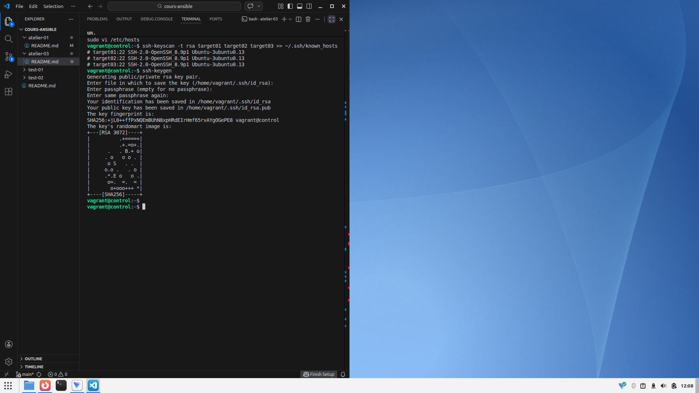
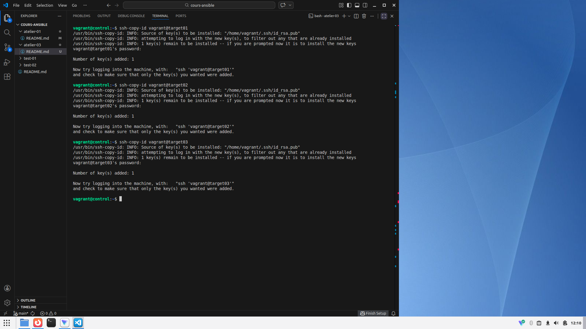
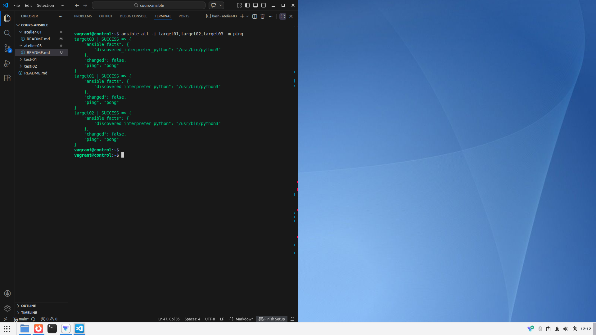

# Atelier 3 - Authentification

## Objectif

L'obejctif est de faire le nécessaire pour réussir un ping Ansible avec le module ansible "ping", comme tel :

```console
$ ansible all -i target01,target02,target03 -m ping
```
---

## Challenge

Lancez les 4 VM et connectez-vous à la VM ```control```

```console
[vagrant@ubuntu:atelier-3] vagrant up
[vagrant@ubuntu:atelier-3] vagrant ssh control
vagrant@control:~$ 
```

Configurez le fichier de /etc/hosts afin d'assigner les VM Target Host aux hostname qui nous utiliserons pour ping à l'aide d'Ansible

Ajoutez les enregistrements suivant :

```conf 
192.168.56.20 target01
192.168.56.30 target02
192.168.56.40 target03
```

Collectez à présent les clefs SSH des 3 VM (Target Host) dans le fichier ~/.ssh/known_hosts
Puis générez une paire de clef SSH simple (remplir la configuration interactive de la génération de clefs n'est pas obligatoire), et copiez-les sur les 3 VM Target Host

```console
vagrant@control:~$ ssh-keyscan -t rsa target01 target02 target03 >> ~/.ssh/known_hosts
```
```console
vagrant@control:~$ ssh-keygen
```



[info] le mot de passe des VM Targets par défaut est ```vagrant```
```console
vagrant@control:~$ ssh-copy-id vagrant@target01
    password: vagrant

vagrant@control:~$ ssh-copy-id vagrant@target02
    password: vagrant

vagrant@control:~$ ssh-copy-id vagrant@target03
    password: vagrant
```



Vous pouvez à présent lancer le module ping de Ansible vers les trois VM Target Host en utilisant les hostnames que nous leur avons attribué au début de cet atelier.

```console
vagrant@control:~$ ansible all -i target01,target02,target03 -m ping
```


