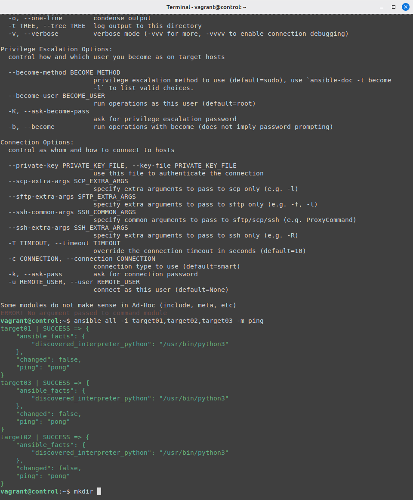
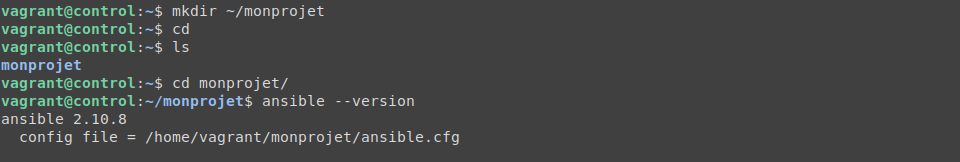
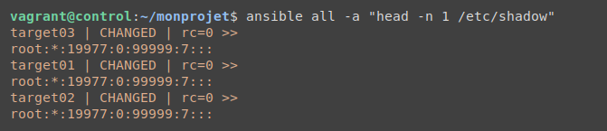

# Atelier 6

## Objectif

- Éditez /etc/hosts de manière à ce que les Target Hosts soient joignables par leur nom d'hôte simple.

- Configurez l'authentification par clé SSH avec les trois Target Hosts.

- Installez Ansible.

- Envoyez un premier ping Ansible sans configuration.

- Créez un répertoire de projet ~/monprojet.

- Créez un fichier vide ansible.cfg dans ce répertoire.

- Vérifiez si ce fichier est bien pris en compte par Ansible.

- Spécifiez un inventaire nommé hosts.

- Activez la journalisation dans ~/journal/ansible.log.

- Testez la journalisation.

- Créez un groupe [testlab] avec vos trois Target Hosts.

- Définissez explicitement l'utilisateur vagrant pour la connexion à vos cibles.

- Envoyez un ping Ansible vers le groupe de machines [all].

- Définissez l'élévation des droits pour l'utilisateur vagrant sur les Target Hosts.

- Affichez la première ligne du fichier /etc/shadow sur tous les Target Hosts.

- Quittez le Control Host et supprimez toutes les VM de l'atelier.  
  
---

## Challenge

### Pré-configuration

> Mise à niveau de l'atelier-06 avec la pré-configuration de l'atelier-03 :

    - lancement des quatres VM avec vagrant  
    - Mise à jour du fichier hosts de la VM ```Control Host``` avec les hostname des trois VM targets  
    - Installation de ansible sur la VM ```Control Host```  
    - Ajout des clefs SSH des VM pour pouvoir ping les trois targets à partir de la VM ```Control Host``` avec le mode ping de ansible  

> Connectez-vous à la Control Host et verifiez la pré-configuration avec la commande suivante sollicitant le mode _ping_ de ansible :

```console
[vagrant@ubuntu:atelier-7] vagrant up
[vagrant@ubuntu:atelier-7] vagrant ssh ansible
vagrant@ansible:~$ 
```
```console
vagrant@control:~$ ansible all -i target01,target02,target3 -m ping
```





### Création de ansible.cfg

> Créer un dossier monprojet dans le répertoire du home avec dedans un fichier ansible.cfg  

> Verifier que le fichier de configuration est bien pris en compte avec la commande suivante :  

```console
vagrant@control:~$ ansible --version
```

> La commande nous retourne le bon chemin vers le nouveau fichier de configuration ansible.cfg créé à l'instant :   
```config file = /home/vagrant/monprojet/ansible.cgf```




### Pré-configuration de l'inventory

> Spécifier dans "_ansible.cfg_" un chemin vers un futur fichier inventory  

```txt
[defaults]
inventory = ./hosts
```
### Activation des logs

> Ajouter dans "_ansible.cfg_" un chemin vers un futur fichier de log  

```txt
[defaults]
...
log_path = ~/journal/ansible.log
```

> Créer le chemin ~/journal qui contiendra le fichier de log. Le fichier se créera de lui-même lorsqu'un log sera généré :  

```console
vagrant@control:~$ mkdir ~/journal
```

Pour tester la création automatique du fichier de log, on peut générer un simple log en réexecutant un ping de l'inventaire comme précédemment  


### Configuration de l'inventory

> Création et configuration du fichier inventory nommé "_hosts_"
    - Ajout d'un groupe "_testlab_" contenant les trois VM target
    - Spécification du nom d'utilisateur _vagrant_ des VM target pour la connexion

```txt
[testlab]
target01
target02
target03

[testlab:vars]
ansible_python_interpreter=/usr/bin/python3
ansible_user=vagrant
```

> Vérification du bon fonctionnement de la configuration avec un ping de l'inventaire (ici nommé "hosts") :  

```console
vagrant@control:~$ ansible hosts -m ping
```
```txt
target02 | SUCCESS => {
    "changed": false,
    "ping": "pong"
}
target01 | SUCCESS => {
    "changed": false,
    "ping": "pong"
}
target03 | SUCCESS => {
    "changed": false,
    "ping": "pong"
}
```

> Verification optionnel pour confirmer que les trois hosts sont bien dans le registre de l'inventaire (fichier "_hosts"_) :  

```console
vagrant@control:~$ ansible all --list-hosts
```

```txt
  hosts (3):
    target01
    target02
    target03
```

### Elévation des privilèges de "vagrant"

L'objectif est d'élever les privilèges de l'utilsiateur ```vagrant``` pour la VM "control" afin qu'elle puisse élargir ses droits d'execution de commandes sur les VM target

> Ajouter le paramètre "_ansible_become=yes_" dans les variables du fichier inventory "_hosts_" :

```txt
[testlab]
...

[testlab:vars]
...
ansible_become=yes
```
Verification de l'élevation des privilèges en executant une commande pour afficher le fichier ```/etc/shadow``` des VM target

```console
vagrant@control:~$ ansible all -a "head -n 1 /etc/shadow"
```




