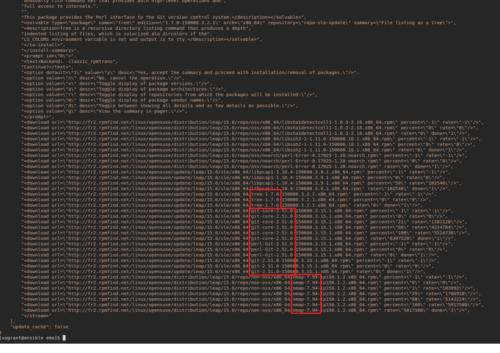

# Atelier 7

## Challenge

Lancez les 4 VM et connectez-vous à la VM ```Control Host```

```console
[vagrant@ubuntu:atelier-7] vagrant up
[vagrant@ubuntu:atelier-7] vagrant ssh control
vagrant@control:~$ 
```

Installez successivement les 3 packages avec une commande _ad hoc_ depuis la VM ```Control Host``` :

```console
vagrant@control:~$ ansible all -m package -a "name=tree,git,nmap state=present)"
```
Le paramètre ```state=present``` permet ici de préciser que nous voulons "installer" les packages mentionnés. Les désinstaller aurait nécessité la valeur de ```state=absent```.


