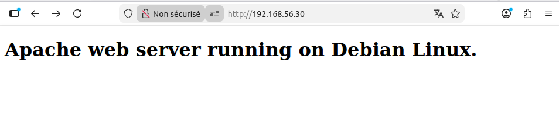
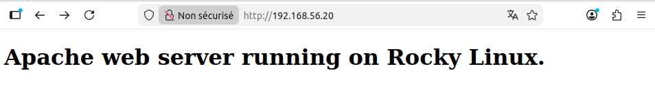
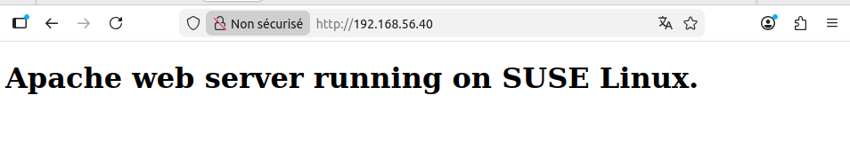

# Atelier 10 - Web Server

## Objectif

Écrivez trois playbooks :

- Un premier playbook apache-debian.yml qui installe Apache sur l'hôte debian avec une page personnalisée Apache web server running on Debian Linux.

- Un deuxième playbook apache-rocky.yml qui installe Apache sur l'hôte rocky avec une page personnalisée Apache web server running on Rocky Linux.

- Un troisième playbook apache-suse.yml qui installe Apache sur l'hôte suse avec une page personnalisée Apache web server running on SUSE Linux.

---

## Challenge

> Lancez les 4 VM et connectez-vous à la VM ```Control Host```

> Création des trois playbook pour les VM Debian, Rocky et SUSE

_playbook-apache-debian.yaml_
```console
---  # playbook-apache-debian.yaml

- hosts: debian

  tasks:

    - name: Update package information
      apt:
    update_cache: true
        cache_valid_time: 3600

    - name: Install Apache
      apt:
    name: apache2

    - name: Install custom web page
      copy:
    dest: /var/www/html/index.html
        mode: 0644
        content: |
          <!doctype html>
          <html>
            <head>
              <meta charset="utf-8">
              <title>Test</title>
            </head>
            <body>
              <h1>Apache web server running on Debian Linux.</h1>
            </body>
          </html>

    - name: Start & enable Apache
      service:
    name: apache2
        state: started
        enabled: true
```


_playbook-apache-rocky.yaml_
```console
---  # playbook-apache-rocky.yaml

- hosts: rocky

  tasks:

    - name: Update package information
      dnf:
    update_cache: true

    - name: Install Apache (httpd)
      dnf:
    name: httpd

    - name: Install custom web page
      copy:
    dest: /var/www/html/index.html
        mode: 0644
        content: |
          <!doctype html>
          <html>
            <head>
              <meta charset="utf-8">
              <title>Test</title>
            </head>
            <body>
              <h1>Apache web server running on Rocky Linux.</h1>
            </body>
          </html>

    - name: Start & enable Apache
      service:
    name: httpd
        state: started
        enabled: true
```



_playbook-apache-suse.yaml_
```console
--- # playbook-apache-suse.yaml
- hosts: suse
  become: true  # Nécessaire pour l'installation et les services
  tasks:

    - name: Install Apache
      zypper:
    name: apache2
        state: present

    - name: Install custom web page
      copy:
    dest: /srv/www/htdocs/index.html
        mode: '0644'
        content: |
          <!doctype html>
          <html>
            <head>
              <meta charset="utf-8">
              <title>Test</title>
            </head>
            <body>
              <h1>Apache web server running on SUSE Linux.</h1>
            </body>
          </html>

    - name: Start & enable Apache
      service:
    name: apache2
        state: started
        enabled: true
```


