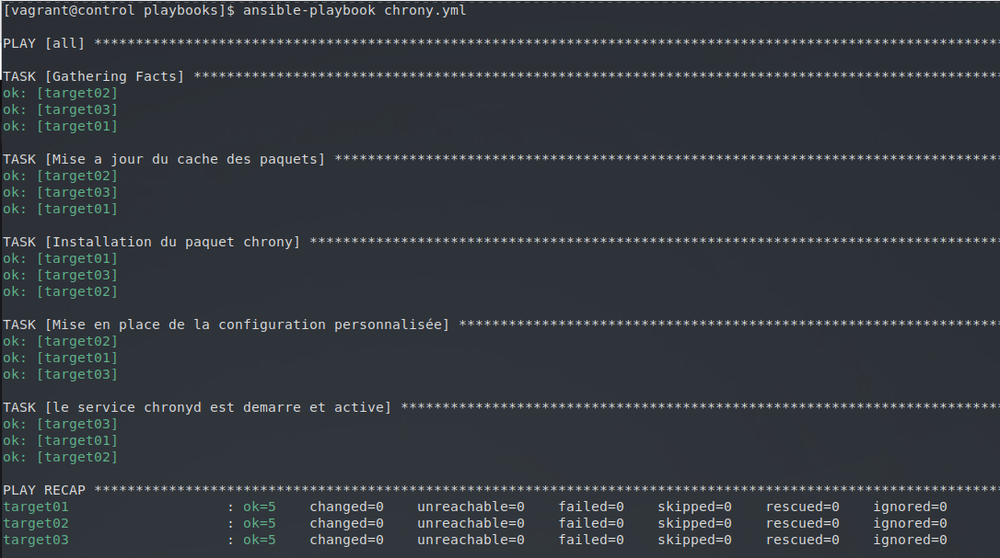

# Atelier 12 - Les Handlers

## Objectif

Écrivez un playbook chrony.yml qui assure la synchronisation NTP de tous vos Target Hosts :

- Installez le paquet chrony.

- Activez et démarrez le service chronyd correspondant.

- Jetez un œil sur le fichier de configuration /etc/chrony.conf fourni par défaut.

- Installez une configuration personnalisée (cf. ci-dessous).

- Prenez en compte cette nouvelle configuration.

- Vérifiez la syntaxe correcte de votre playbook chrony.yml.

- Vérifiez l'idempotence de votre playbook.

Voici la configuration à installer :

_/etc/chrony.conf_

```sh
# /etc/chrony.conf
server 0.fr.pool.ntp.org iburst
server 1.fr.pool.ntp.org iburst
server 2.fr.pool.ntp.org iburst
server 3.fr.pool.ntp.org iburst
driftfile /var/lib/chrony/drift
makestep 1.0 3
rtcsync
logdir /var/log/chrony
```

---

## Challenge

> Comme habituellement, commencez par lancer vos 4 VM et connectez-vous à votre VM de ```Control Host```

### Créer un playbook pour installer chrony

Voici le résultat de notre objectif que nous allons détailler juste après

_playbook-chrony.yaml_

```yaml                                             
--- # chrony.yml
- hosts: all
  become: true

  tasks:
    - name: Mise a jour du cache des paquets
      dnf:
        update_cache: yes

    - name: Installation du paquet chrony
      dnf:
        name: chrony
        state: present

    - name: Mise en place de la configuration personnalisée
      copy:
        dest: /etc/chrony.conf
        owner: root
        group: root
        mode: '0644'
        content: |
          # /etc/chrony.conf
          server 0.fr.pool.ntp.org iburst
          server 1.fr.pool.ntp.org iburst
          server 2.fr.pool.ntp.org iburst
          server 3.fr.pool.ntp.org iburst

          driftfile /var/lib/chrony/drift
          makestep 1.0 3
          rtcsync
          logdir /var/log/chrony
      notify: Reboot chronyd

    - name: le service chronyd est demarre et active
      service:
        name: chronyd
        state: started
        enabled: true

  handlers:
    - name: Reboot chronyd
      service:
        name: chronyd
        state: restarted
```

> Voyons plus en détail ce que fait ce playbook

- En bonne pratique, la première tâche "Mise a jour du cache des paquets", comme son nom l'indique, rafraîchi les informations du cache des packages de l'outil d'installation pour ensuite en seconde tâche installer ```chrony```.

- Une fois celui-ci installé, la tâche qui suit, "Mise en place de la configuration", injecte avec le paramètre "copy" notre configuration chrony dans le fichier ```/etc/chrony.conf``` de la VM en précisant bien les drotis sur le fichier, le owner avec son groupe (ici root). 

- Une fois injecté, s'il y a bien eu une modification appliquée sur la VM lors de la phase d'injection, alors le "handler" est appelé par le paramètre "notify: Reboot chronyd". 

- A la fin de la dernière tâche, le service de chronyd est confirmé comme bien démarré est en mode "enable" pour chaque démarrage de la VM. 

- Le Handler ici aura fait office de "post-configuration", en executant son bout de code lorsqu'il est appelé.


> Afin de verifier l'idempotence. Vous pouvez lancer deux fois de manière consécutive le playbook et comparer les résultats :



On n'observe aucun changement, votre playbook est donc bien idempotent !
